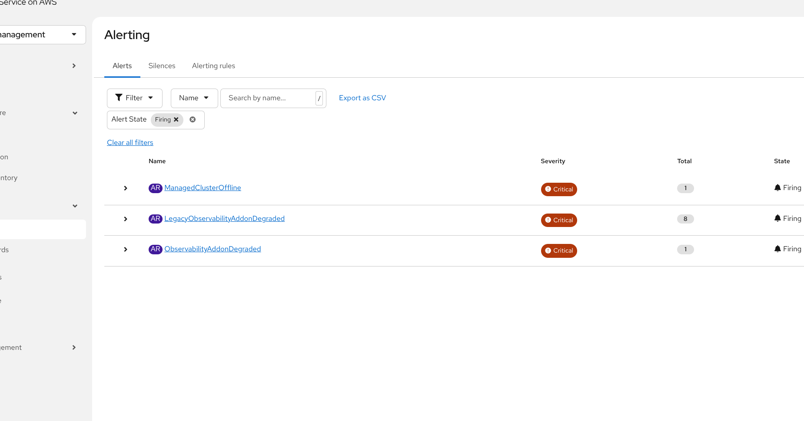
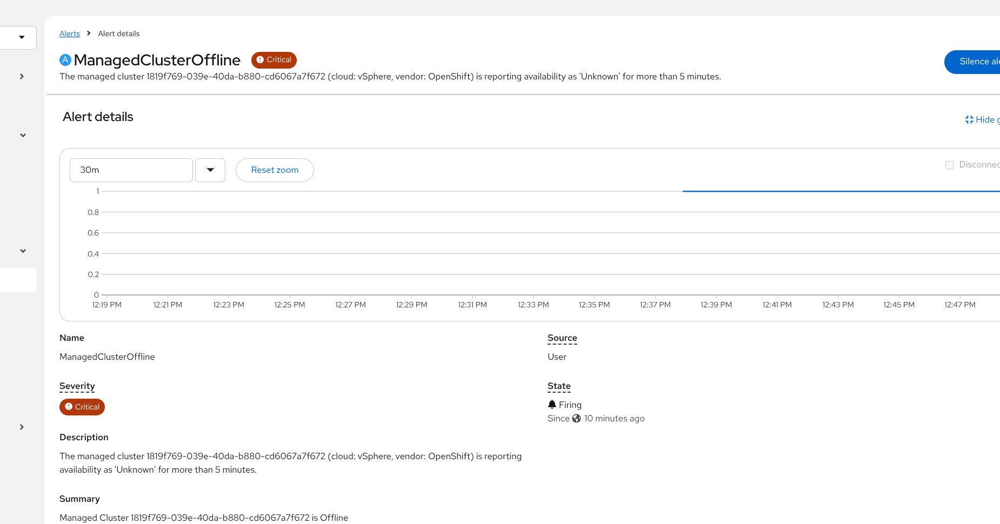

# Catching Offline Managed Clusters Early: creating Alerts for metric `acm_managed_cluster_info` 

tested with ACM 2.17 MCOA metrics enabled.
 
If you run Red Hat Advanced Cluster Management (ACM) for Kubernetes at fleet scale, you already know the pain of finding out a managed cluster went offline only after someone complains. Out of the box, ACM's observability stack doesn't scrape and store every metric available on the hub — it relies on an **allowlist** (or a **custom scrape config**) to decide what gets collected and forwarded to Thanos.
 
One of the most useful metrics for fleet lifecycle monitoring, `acm_managed_cluster_info`, is **not enabled by default** today. Until it becomes a default metric in a future ACM release, you have to add it yourself. This post walks through why you'd want it, how to enable it, and how to wire up a critical alert that fires the moment a managed cluster drops offline.
 

## Why `acm_managed_cluster_info` matters
 
`acm_managed_cluster_info` is a metric exposed on the hub that reports the availability state of every managed cluster ACM knows about, including labels like:
 
- `managed_cluster_id`
- `available` (`True`, `False`, `Unknown`)
- `cloud`
- `vendor`
Without this metric being scraped, you have no clean, label-rich signal to alert on when a spoke cluster becomes unreachable. Cluster status is visible in the ACM console, but there's no proactive push notification — someone has to go looking.
 
By enabling this metric and pairing it with a Thanos Ruler alerting rule, you get a **critical alert the moment a cluster's availability flips away from `True`**, surfaced directly in the ACM Alerting UI (and onward to Alertmanager/PagerDuty/Slack if you have those receivers configured).
 

## Step 1 — Add the metric to the custom allowlist (or into a scrapeconfig if you use MCOA)
 
ACM Observability ships a `ConfigMap` called `observability-metrics-custom-allowlist` in the `open-cluster-management-observability` namespace. This is where you extend the default allowlist without touching the operator-managed default one.
 
```yaml
apiVersion: v1
kind: ConfigMap
metadata:
  name: observability-metrics-custom-allowlist
  namespace: open-cluster-management-observability
data:
  metrics_list.yaml: |
    names:
      - acm_managed_cluster_info
```
 
If a `observability-metrics-custom-allowlist` ConfigMap already exists in your environment, **edit it in place** — don't overwrite it, or you'll drop any other custom metrics you've already enabled:
 
```bash
oc -n open-cluster-management-observability edit configmap observability-metrics-custom-allowlist
```
 
Alternatively, if you're scraping this from a custom target rather than the standard collector path, you can add it via a custom `ScrapeConfig` instead of the allowlist — the end result (the metric landing in Thanos) is the same.
 
> **Note:** Once this metric graduates to the ACM default allowlist in a future release, this manual step won't be necessary. Until then, it needs to be added explicitly per hub.
 
## Step 2 — Add the alerting rules
 
With the metric flowing into Thanos, the second piece is the alerting rule itself. This lives in the `thanos-ruler-custom-rules` ConfigMap, also in `open-cluster-management-observability`:
 
```yaml
kind: ConfigMap
apiVersion: v1
metadata:
  name: thanos-ruler-custom-rules
  namespace: open-cluster-management-observability
  labels:
    cluster.open-cluster-management.io/backup: ''
data:
  custom_rules.yaml: |
    groups:
      # -------------------------------------------------------------
      # Fleet Control Plane Lifecycle Alerting Rules (Case 1)
      # -------------------------------------------------------------
      - name: fleet-lifecycle-alerts
        rules:
          # Fires immediately if a managed cluster goes offline or unreachable
          - alert: ManagedClusterOffline
            expr: acm_managed_cluster_info{available!="True"} == 1
            for: 5m
            labels:
              severity: critical
            annotations:
              summary: "Managed Cluster {{ $labels.managed_cluster_id }} is Offline"
              description: "The managed cluster {{ $labels.managed_cluster_id }} (cloud: {{ $labels.cloud }}, vendor: {{ $labels.vendor }}) is reporting availability as '{{ $labels.available }}' for more than 5 minutes."
 
      # -------------------------------------------------------------
      # Telemetry Pipeline Health Alerting Rules (Case 2) Use only one of them
      # -------------------------------------------------------------
      - name: telemetry-addon-alerts
        rules:
          # Alert when the MCOA (Modern Agent) is degraded or crashed
          - alert: ObservabilityAddonDegraded
            expr: acm_managed_cluster_labels{feature_open_cluster_management_io_addon_multicluster_observability_addon!="available"} == 1
            for: 5m
            labels:
              severity: critical
            annotations:
              summary: "Telemetry Pipeline Degraded on Cluster {{ $labels.cluster }}"
              description: "The observability addon on cluster {{ $labels.cluster }} is reporting as '{{ $labels.feature_open_cluster_management_io_addon_multicluster_observability_addon }}' instead of 'available'."
 
          # Alert when the Legacy MCO (Endpoint Operator) is degraded or crashed
          - alert: LegacyObservabilityAddonDegraded
            expr: acm_managed_cluster_labels{feature_open_cluster_management_io_addon_observability_controller!="available"} == 1
            for: 5m
            labels:
              severity: critical
            annotations:
              summary: "Legacy Telemetry Pipeline Degraded on Cluster {{ $labels.cluster }}"
              description: "The legacy observability addon on cluster {{ $labels.cluster }} is reporting as '{{ $labels.feature_open_cluster_management_io_addon_observability_controller }}' instead of 'available'."
```
 
Apply it:
 
```bash
oc apply -f thanos-ruler-custom-rules.yaml
```
 
The Thanos Ruler operator will pick up the change and reload the rule group automatically — no restart needed.
 
 
## Step 3 — Confirm the metric is flowing
 
Before expecting alerts to fire, sanity-check that the metric is actually present in Thanos/Grafana:
 
```bash
oc -n open-cluster-management-observability exec -it <thanos-querier-pod> -- \
  curl -s 'http://localhost:9090/api/v1/query?query=acm_managed_cluster_info'
```
 
You should see one time series per managed cluster, each carrying `managed_cluster_id`, `available`, `cloud`, and `vendor` labels.
 
 
## Step 4 — Watch it fire in the ACM Alerting UI
 
Once the allowlist and rule changes are in place, take a managed cluster offline (or wait for a real outage) and the `ManagedClusterOffline` alert will appear as **Critical** in the ACM console's **Alerting** view within about 5 minutes:
 

 
Clicking into the alert gives you the full label and annotation detail — cluster ID, cloud, vendor, and how long it's been unavailable — everything you need to triage without leaving the console:
 

 
 
## Wrapping up
 
Two small ConfigMap edits — one allowlist entry, one alerting rule — turn a metric that used to just sit unused into a proactive, fleet-wide "a cluster just went dark" signal inside ACM's native Alerting UI. Until `acm_managed_cluster_info` ships in the default allowlist, this is a quick and low-risk change worth rolling out to every hub in your environment.
 
